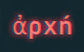

<div align="center">



# ἀρχή (Arke)
### *First Principles for a Sovereign Developer Environment*

</div>

---

## 🏛️ Philosophy

**ἀρχή** (Arke) is a Greek word meaning "origin", "beginning", or "first principle". 

This configuration is built on the belief that a developer's environment should be:
1. **Reproducible**: Built from source and logic, not ad-hoc commands.
2. **Simple**: Implementation simplicity beats interface complexity ("Worse is Better").
3. **Sovereign**: Free from corporate lock-in and centralized control.

## 🛡️ Sovereignty & Lix

To maintain a truly independent and community-driven system, we recommend sidestepping standard Nix in favor of **[Lix](https://lix.systems)**. Lix is a robust, compatible, and independent implementation that ensures your configuration remains yours.

### 💿 Installation (macOS)

1. **Install Lix**  
   Follow the official instructions at [lix.systems/install](https://lix.systems/install) to get the sovereign Nix implementation.

2. **Clone this repository**
   ```bash
   git clone https://github.com/rickpr/arke.git
   cd nix-config
   ```

3. **Configure your Variables**  
   Edit `variables.nix` to match your local system details:
   ```nix
   {
     user = "your_user";
     fullName = "Your Name";
     email = "your@email.com";
     signingKey = "YOUR_GPG_KEY_ID";
     macHostname = "your_hostname";
     macSystem = "aarch64-darwin"; # or x86_64-darwin
   }
   ```

4. **Build and Switch**  
   Run the build script (requires sudo):
   ```bash
   chmod +x build_macos.sh
   ./build_macos.sh
   ```

## ⚙️ Architecture

- **`flake.nix`**: The entry point, orchestrating outputs for macOS and Linux.
- **`variables.nix`**: Your centralized identity and hardware configuration.
- **`darwin.nix`**: macOS system-level settings and Homebrew integration.
- **`home.nix`**: Home Manager configuration (Git, Zsh, Emacs, Ghostty).
- **`common.nix`**: Shared packages across all platforms.

## 🚀 Advanced Git
This setup includes **Git Delta** for beautiful, readable diffs and **zdiff3** for smarter conflict resolution.

## 💡 Tips & Gotchas

### 🚪 Escape Hatches
While this config aims to be comprehensive, you may need machine-specific tweaks that you don't want to commit:
- **Zsh**: The config automatically sources `~/.zshrc_local` if it exists. Use this for private PATH exports, aliases, or secret environment variables.
- **Identity**: All personal identifiers (email, GPG, hostname) are centralized in `variables.nix`.

### ⚠️ The "Clobbering" Problem
Home Manager is protective of your `$HOME`. If you already have a `.zshrc`, `.tmux.conf`, or `.emacs.d` folder, the build will **fail** rather than overwrite your data.
- **Solution**: Before your first run, move your existing config files to a backup (e.g., `mv ~/.zshrc ~/.zshrc_local`). Home Manager will then create the appropriate symlinks.

### 🛠️ Manual Interventions
- **Postgres**: This config manages the Postgres service, but you may need to initialize the data directory or start the service manually the first time using `brew services` or `pg_ctl` depending on your setup.
- **Ghostty Shaders**: Shaders are included via a Git submodule/input and symlinked automatically.
